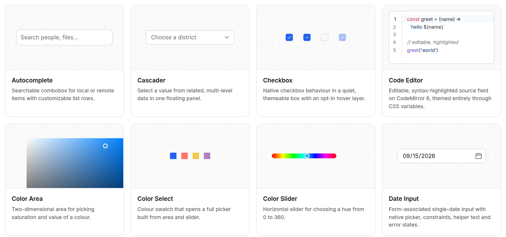
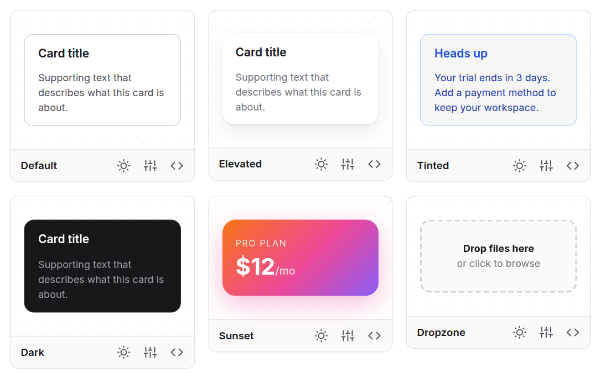
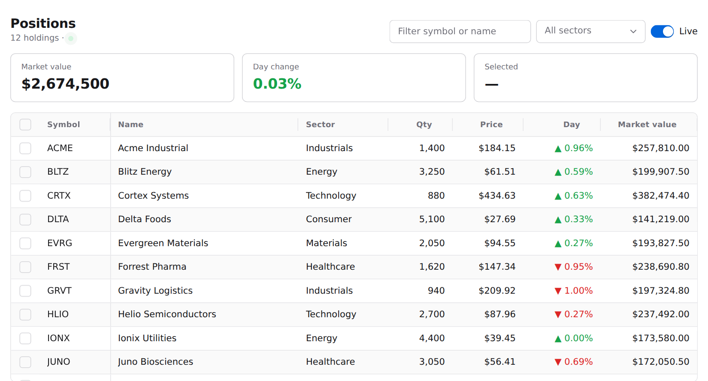

# c2n/web-components

[](https://www.npmjs.com/org/c2n)
[](https://github.com/code2nguyen/web-components/actions/workflows/component-tests.yml)
[](https://www.npmjs.com/package/@c2n/core)
[](LICENSE)

**Every building block your AI needs to ship a web app.** 100+ components and 800+ ready-made variants, built with AI and for AI. Your coding agent reads the exact API of every element over MCP and composes it into real apps, in plain HTML, React, Vue, Angular, Astro or anything that speaks the DOM.

**[Docs & live demos](https://code2nguyen.github.io/web-components/)** · [Components](https://code2nguyen.github.io/web-components/docs) · [Examples](https://code2nguyen.github.io/web-components/examples) · [Theming](https://code2nguyen.github.io/web-components/guides/theming)

<picture>
  <source media="(prefers-color-scheme: dark)" srcset=".github/assets/overview.dark.png">
  
</picture>

## Highlights

- **Built for AI agents**: an MCP server (`@c2n/mcp`) and a Claude Code / Codex / Copilot skill (`@c2n/skill`) hand your agent exact APIs, examples and themes, so it builds instead of guessing.
- **100+ components, 800+ variants**: inputs, tables, charts, maps, overlays, navigation, chat, dashboards, plus icon sets and illustrations.
- **One package, ship only what you use**: `npm install @c2n/components`, import `@c2n/components/table`; bundlers drop the rest.
- **Themed with CSS variables**: ~35 `--c2-theme--*` tokens restyle the whole app, light and dark built in.
- **Any framework**: generated React/Vue types, an Angular forms adapter, SSR-safe elements.

## Quick start

```bash
npm install @c2n/components
```

```js
import '@c2n/components/theme.css'
import '@c2n/components/button'
import '@c2n/components/text-field'
```

```html
<form class="newsletter">
  <c2-text-field placeholder="Your email"></c2-text-field>
  <c2-button type="submit">Subscribe</c2-button>
</form>
```

Make it yours by setting a few tokens, or style one component through its own variables:

```css
:root {
  --c2-theme--color-primary: #7c3aed;
  --c2-theme--radius-md: 10px;
}

.newsletter c2-button {
  --c2-button__container--height: 44px;
}
```

React, Vue and Angular setup: [Frameworks guide](https://code2nguyen.github.io/web-components/guides/frameworks).

## A gallery for every component

Each component ships styled variants you can copy, or open in the live studio to tweak and export.

<picture>
  <source media="(prefers-color-scheme: dark)" srcset=".github/assets/gallery.dark.png">
  
</picture>

## Real apps

Complete [example apps](https://code2nguyen.github.io/web-components/examples) in React, Vue, Angular, Next.js and plain HTML live in [`apps/examples`](apps/examples).

<picture>
  <source media="(prefers-color-scheme: dark)" srcset=".github/assets/example.dark.png">
  
</picture>

## Use with AI agents

```bash
claude mcp add --transport stdio c2n -- npx -y @c2n/mcp
```

Or install the Claude Code plugin: `/plugin marketplace add code2nguyen/web-components` then `/plugin install c2n@c2n`.

## Contributing

```bash
npm install
npm run ui                                    # build everything, start the docs site
npm run dev -w packages/components/button     # work on one component
npm test                                      # browser tests for changed components
npm run generate                              # scaffold a new component
```

More in [`tests/README.md`](tests/README.md) and [`CLAUDE.md`](CLAUDE.md).

## License

[MIT](LICENSE)
