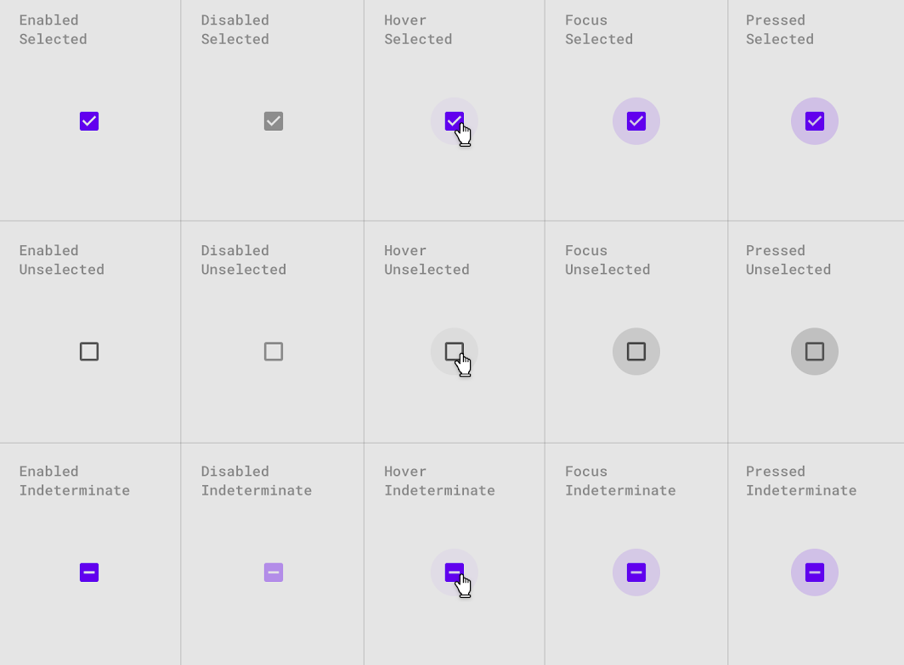

# Checkbox

Following m3 specs : https://m3.material.io/components/switch/specs

## States

### Matrix of states

| Interaction/mode | Selected | Unselected | Indeterminate |
| ---------------- | -------- | ---------- | ------------- |
| Enabled          |          |            |               |
| Hover            |          |            |               |
| Focus            |          |            |               |
| Pressed          |          |            |               |
| Error            |          |            |               |
| Disabled         |          |            |               |

## Theme properties

- border-radius
- background-color
- border-color
- icon-color
- state-color
- state-opacity
